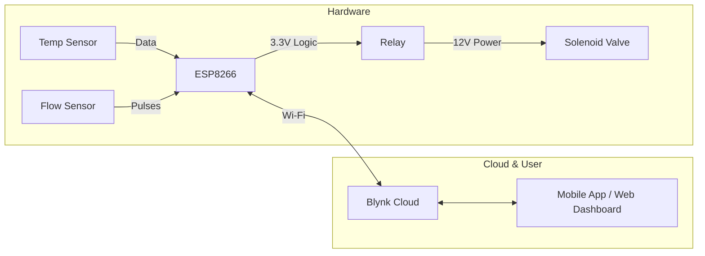

# Smart Drip Irrigation System

Welcome to the documentation for the IoT-Based Automatic Drip Irrigation System. This project provides a robust, ESP8266-powered solution for automated gardening, precision agriculture, and smart home integration.

## Overview
This system bridges the gap between hardware sensors and cloud-based control. Using the Blynk IoT platform, it monitors water flow and ambient temperature, offering four distinct watering modes to ensure your plants get exactly what they need, exactly when they need it.

### System Architecture

